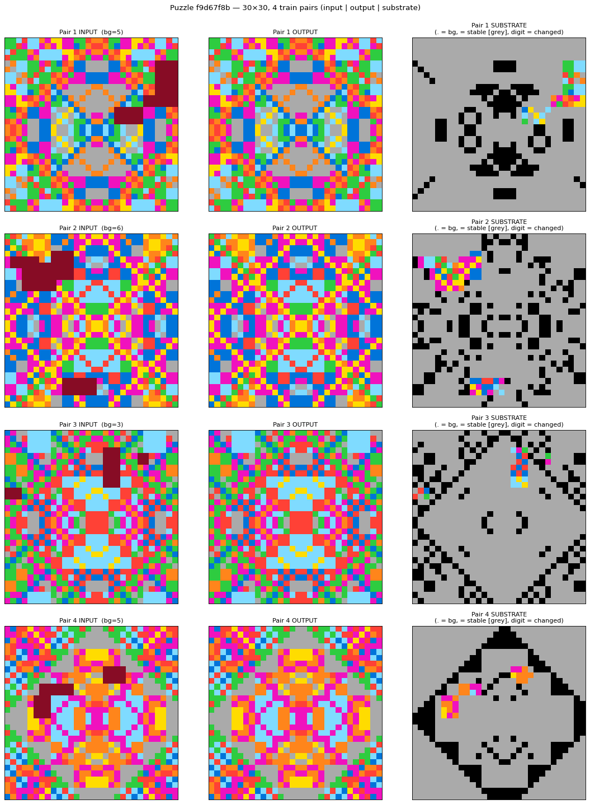

# Case study: puzzle `f9d67f8b` — symmetry completion at 30×30



The four rows are the four train pairs. Left column: input. Middle: output (same as input but with 9-cells filled in). Right: the substrate — grey `=` for stable cells, colored digits for cells that changed, and `.` (rendered as background) for whatever color the dense-puzzle heuristic picked as background in that pair.

The substrate is where the rule becomes visible: against a sea of grey "this cell stayed the same," the colored dots are *only* the cells the rule had to fill in — and they trace out the 8-fold symmetry of the underlying pattern.

## Why this puzzle is interesting

A hard ARC puzzle that illustrates three things at once:
1. **The substrate hypothesis at its strongest** — the rule is almost invisible in raw grids but obvious in the substrate.
2. **The limits of `background_of()`** — when no color dominates, background detection becomes arbitrary and changes per pair.
3. **The agent corpus pipeline working** — Claude solved it on batch 61 (after many wrong attempts); Qwen baseline failed all 10 sample runs.

## The puzzle

- **Size:** 30×30, 4 train pairs, 1 test pair
- **Source:** `data/arc1_eval/f9d67f8b.json` (also in `data/arc2_train/`)
- **Visual:** densely tiled grid, all 9 colors used, no clear background

Each input has scattered "9" (maroon) cells — these are *missing/corrupted pixels*. The output is the same grid with the 9s filled in correctly.

## The rule

The grid has **8-fold symmetry** around an implicit center:
- 4-fold rotational symmetry of a 32×32 grid cropped to 30×30 (axes at coordinate 31 - r)
- Plus transpose and anti-transpose symmetries

For each "9" cell, find one of its 7 symmetric partners and copy that partner's color. Iterate until no 9s remain.

Conceptually simple. Visually invisible without a denoising representation.

## Substrate clarity

In the raw grid, the "9" pixels are buried in a sea of colored noise — your eye has to scan all 900 cells to find them.

In the **substrate**, the unchanged cells become `=` (rendered as grey), the background becomes `.`, and only the cells that changed (the formerly-9 cells filled with their inferred values) appear as colored digits.

For each pair the substrate reveals **30-50 colored cells against a grey/black background** — and those cells are exactly the symmetric positions the rule had to fill in. The symmetry pattern is staring at you.

This is the substrate hypothesis in one image: by deterministic preprocessing, the rule becomes visible. The substrate doesn't make the model "smarter" — it collapses the output dimensionality from 900 cells to ~50, dramatically shrinking the sampling-drift surface.

## Background detection quirk

This puzzle is `background_of()`'s worst case. No color dominates, so background detection is statistically arbitrary:

| Pair | Background picked | Top counts |
|------|-------------------|------------|
| 1 | 5 (grey)    | grey 15.6% beats green 13.8% by 14 cells |
| 2 | 6 (magenta) | magenta 19.6% wins clearly |
| 3 | 3 (green)   | green 18.8% beats red 18.6% by 2 cells |
| 4 | 5 (grey)    | grey and magenta TIED at 165 cells; smallest-value tiebreaker wins |

So the same puzzle has a *different* "background" in each pair. That's not a bug — the encode/decode round-trip still holds — but it does mean human readability of the substrate degrades on dense puzzles. The model doesn't care; it learns a deterministic mapping regardless of which color gets called background.

## Agent corpus stats

- **Claude:** 1 right_code (solved on `claude_agent_batch_061_v2_direct_write` — many earlier attempts failed)
- **Qwen baseline (Qwen-2.5-7B-Instruct, 10 samples):** 0 right_codes, 10 wrong_codes — completely failed

This is exactly the kind of puzzle the fine-tune should improve on. The base Qwen can't see the symmetry without scaffolding. If the substrate training transfers to code generation, post-fine-tune Qwen should do meaningfully better on this puzzle and its augmented variants.

## Claude's working code (the one right_code)

```python
def solve(input_grid):
    H = len(input_grid)
    W = len(input_grid[0])
    g = [row[:] for row in input_grid]

    def sym_positions(r, c):
        # Grid has symmetries around the line/point at coordinate 31
        # (effectively 4-fold symmetry of a 32x32 grid cropped to 30x30),
        # plus transpose/anti-transpose symmetries.
        return [
            (31 - r, c),
            (r, 31 - c),
            (31 - r, 31 - c),
            (c, r),
            (31 - c, r),
            (c, 31 - r),
            (31 - c, 31 - r),
        ]

    changed = True
    while changed:
        changed = False
        for r in range(H):
            for c in range(W):
                if g[r][c] == 9:
                    for nr, nc in sym_positions(r, c):
                        if 0 <= nr < H and 0 <= nc < W and g[nr][nc] != 9:
                            g[r][c] = g[nr][nc]
                            changed = True
                            break
    return g
```

15 lines once you see the rule. The reasoning step ("the grid has 8-fold symmetry around coord 31") is where the agent had to do the actual work; the code itself is mechanical iteration until fixed point.
